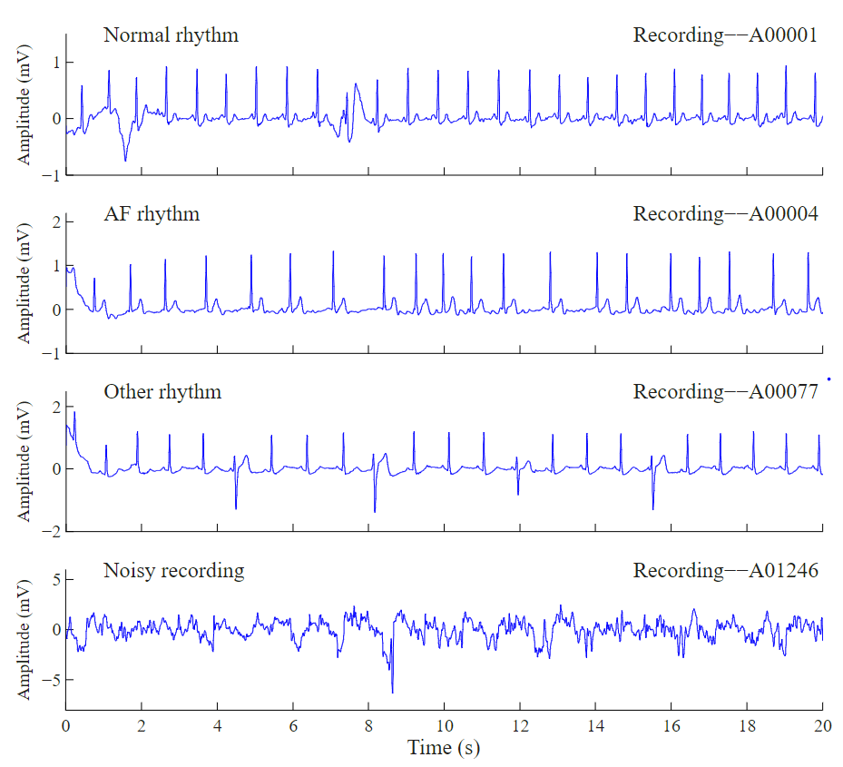
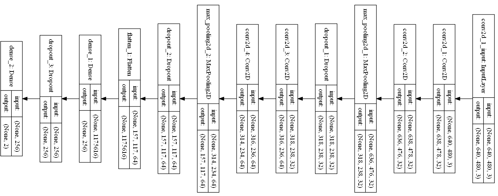

# DeepNetAFib
AFib is formally described as a “tachyarrhythmia characterized by predominantly uncoordinated atrial activation with consequent deterioration of atrial mechanical function” based on the American College of Cardiology (ACC), 
the American Heart Association (AHA) and the European Society of Cardiology (ESC) [[1](https://physionet.org/content/challenge-2017/1.0.0/)]. Apparantly, AFib is the most sustained form of arrhythmia, occurring in 1-2% of the general population and is directly attributed with 
significant risk of stroke and heart failure. DeepNetAFib is a simple python class that employs a deep CNN (VGG like) to classify AFib segments. The temporal 1d signals are convert to time-frequenyc 
representation using Short Time Fourirer Transform (STFT) and then their STFT is trained. If you do not have a GPU the training might take some time. This simple routine
achieves 88% accuracy which is better than naive LSTMs reaching around 80%. Taking CWT of the signal is definitely a better way but the challenge is to choose the right
mother wavelet. Also, the upsampling employed here is very simple and more sophisticated methods such as SMOTE might help improve the accuracy.

## Example of AFib
Examples of the AFib and normal ECG segments are illustrated below.

## CNN structure
The structure of the network is illustrated below.

